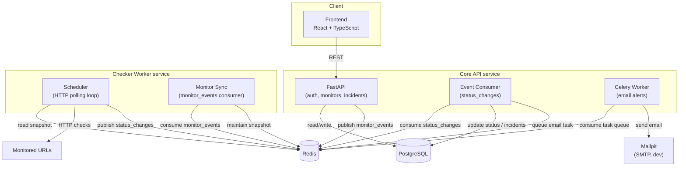

# PulseWatch

Self-hosted, event-driven uptime monitoring platform. Users register HTTP
endpoints to track; an independent checker service polls them on
configurable intervals, publishes status-change events over Redis Streams,
and the core API consumes those events to update history, trigger email
alerts, and power a live dashboard with uptime statistics.

## Architecture



The **API** and **checker worker** are independently deployable services
that never share a database — the worker holds no direct dependency on
PostgreSQL at all. Coordination happens entirely through two Redis Streams:

- **`monitor_events`** — the API publishes `created`/`updated`/`deleted`
  events whenever a monitor changes. The worker's `monitor_sync` consumer
  replays/consumes these into a local, version-stamped snapshot (a Redis
  Hash) so it always knows the current set of monitors to check, without
  ever querying Postgres.
- **`status_changes`** — the worker's scheduler publishes an event **only
  when a monitor's status actually changes** (up → down or down → up),
  not on every check. The API's consumer reads these, updates monitor
  status, opens/resolves `Incident` rows, and queues Celery tasks for
  downtime/recovery emails.

Both consumer groups use `XAUTOCLAIM` to reclaim messages left pending by
a crashed consumer, retry with backoff before dead-lettering malformed or
persistently failing messages, and fall back to an emergency ack if even
the dead-letter write fails — so a poison message can never block the
stream indefinitely.

## Stack

| Layer | Technology |
|---|---|
| Core API | FastAPI, SQLAlchemy (async), Alembic |
| Checker worker | Python, httpx, asyncio (no database access) |
| Event bus | Redis Streams (consumer groups) |
| Background jobs / email | Celery + Redis broker, aiosmtplib |
| Auth | JWT (PyJWT + bcrypt), email verification flow |
| Frontend | React, TypeScript, Vite, Tailwind v4 |
| Frontend state | TanStack Query (server state), Zustand (auth) |
| Database | PostgreSQL |
| Containerization | Docker + Docker Compose |
| Dev tooling | uv, ruff, pre-commit, concurrently |

## Project structure

```
pulsewatch/
├── api/            # FastAPI app + event consumer + Celery tasks
├── worker/         # Checker worker (scheduler + monitor sync, own uv project)
├── frontend/       # React + TypeScript SPA
├── docker-compose.yml       # full stack
└── docker-compose.dev.yml   # infra only (db, redis, mailpit) for local dev
```

Each backend service (`api/`, `worker/`) has its own `pyproject.toml` and
`uv.lock` — they are deliberately separate Python environments with no
shared dependencies, reflecting that they're independently deployable.

## Running it

### Full stack, in Docker

```bash
cp .env.example .env
docker compose up --build
```

- API: `http://localhost:8000` (docs at `/docs`)
- Frontend: `http://localhost:5173`
- Mailpit UI (dev email inbox): `http://localhost:8025`

### Local development, with hot-reload

Run infra in Docker, everything else natively:

```bash
docker compose -f docker-compose.dev.yml up -d

cp api/.env.example api/.env
cp worker/.env.example worker/.env
cp frontend/.env.example frontend/.env

cd api && uv run alembic upgrade head && cd ..

npm install
npm run dev
```

`npm run dev` runs the API, event consumer, Celery worker, checker
scheduler, monitor sync, and the Vite dev server together in one
terminal via `concurrently`.

## Known limitations / trade-offs

These are deliberate scope decisions, documented rather than hidden:

- **Dual-write between Postgres and Redis.** `Monitor` writes commit to
  the database and publish to `monitor_events` as two separate steps. A
  crash between them would desync the worker's view from the database. A
  production system would use a transactional outbox instead.
- **Polling, not push, on the frontend.** The dashboard re-fetches on an
  interval rather than subscribing to a WebSocket/SSE stream. Status
  changes happen on the order of check intervals (60s+), so real-time
  push would add infrastructure complexity without meaningful UX benefit
  at this scale.
- **No repository layer.** Services call SQLAlchemy directly rather than
  going through a repository abstraction — there's a single persistence
  backend and no plan to swap it, so the extra layer would be indirection
  without a forcing function.
- **No rate limiting** on auth endpoints (e.g. resend-verification).
  Noted here rather than addressed, since it's not exercised by the demo.

## License

MIT
